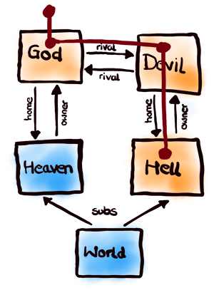

[Extraction](http://rse.github.io/extraction/)
==========

Tree Extraction for JavaScript Object Graphs

<p/>


<p/>


About
-----

Extraction is a small JavaScript library for extracting object trees
from arbitrary object graphs. Object graphs usually have cycles and
contain many information. Hence, the clue is that the extracted object
trees use links to break object reference cycles and can be just
partial by leaving out non-requested information. The tree extraction
is controlled with a custom JSON-style query language. The object tree
is structurally derived from the object graph, but contains no
references to the original objects and hence can be further mutated by
the caller.

The Extraction library is intended for two main use cases: primarily, to
support the generation of responses in REST APIs based on object graphs
(where the cycle problem and the partial information problem has to be
resolved) and, secondarily, to support the persisting and restoring of
arbitrary in-memory object graph structures (where the cycle problem has
to be resolved, too).

Notice: this library intentionally does provide only a query language
for the tree extraction (starting at a certain tree root node) and not
also a query language for locating the tree root node. Locating nodes in
a graph is not within the scope of this library.

[Play around with Extraction in the interactive demo!](http://rse.github.io/extraction/)

Sneak Preview
-------------



```js
import { extract, reify } from "./lib/extraction"
import { expect } from "chai"

/*  the graph  */
var Graph = {
    Person: [
        { id: 7,   name: "God",   tags: [ "good", "nice" ] },
        { id: 666, name: "Devil", tags: [ "bad", "cruel" ] } ],
    Location: [
        { id: 0,   name: "World"  },
        { id: 1,   name: "Heaven" },
        { id: 999, name: "Hell"   } ] }
Graph.Person[0].home    = Graph.Location[1]
Graph.Person[1].home    = Graph.Location[2]
Graph.Person[1].rival   = Graph.Person[0]
Graph.Person[0].rival   = Graph.Person[1]
Graph.Location[1].owner = Graph.Person[0]
Graph.Location[2].owner = Graph.Person[1]
Graph.Location[0].subs  = [ Graph.Location[1],
                            Graph.Location[2] ]

/*  use case 1: tree extraction  */
let tree = extract(Graph.Person[0],
    "{ name, rival: { home: { *, !owner, !subs } } }")
expect(tree).to.be.deep.equal(
    { name: "God", rival: { home: { id: 999, name: "Hell" } } })

/*  use case 2: graph persistance  */
let storage = JSON.stringify(extract(Graph, "{ -> oo }"))
expect(reify(JSON.parse(storage))).to.be.deep.equal(Graph)
```

Installation
------------

#### Node environments (with NPM package manager):

```shell
$ npm install extraction
```

#### Browser environments (with Bower package manager):

```shell
$ bower install extraction
```

Usage
-----

The Extraction library exposes two API functions (signatures given in TypeScript notation):

### `extract`

This is the main API method for extracting an object tree from an object
graph with the help of a tree extraction DSL.

```
extraction.extract(graph: object, spec: string, options?: object): object
```

- The `graph` argument has to be an Array of Object and be any start node in the graph.

- The `spec` argument is the tree extraction specification Domain-Specific Language (DSL).
  It has to follow the following PEG-style grammar:

    RHS      |     | LHS
    ---------|-----|---------------------------
    spec     | ::= | object / array
    object   | ::= | `"{"` content? `"}"`
    array    | ::= | `"["` content? `"]"`
    content  | ::= | (`"->"` num) / (field (`","` field)*)
    field    | ::= | (property `":"` spec) / (`"!"`? property)
    property | ::= | id / `"*"` / (num `".."` num) / num
    num      | ::= | (`"-"`? `[0-9]`+) / `"-oo"` / `"oo"`
    id       | ::= | `[$a-zA-Z_][$a-zA-Z0-9_]`\*

  Hint: the matching of multiple `field` in `content` follows a last-match semantic!

- The `options` argument is optional and can contain the following properties:

    - `procValueBefore: (value: any, path: string) => any`:<br/>
       Pre-process a value (object or property value) at `path` before
       it is taken into account. A caller could use this to convert the
       value from a custom type into a standard JavaScript type.

    - `procValueAfter: (value: any, path: string) => any`:<br/>
       Post-process a value (object or property value) at `path` after
       it was taken into account. A caller could use this to convert the
       value into an external representation like JSON or XML.

    - `makeRefValue: (value: Object, pathNow: string, pathFirst: string) => any`:<br/>
       Make an object reference out of an object `value`, which is now found (again)
       at path `pathNow` and the first-time found at `pathFirst`. The default
       is to use `pathFirst` as the reference, but a caller could also use
       a stub for `value` (usually based on just the OID of it) as the reference.

    - `getKeysOfObject: (value: Object) => String[]`:<br/>
       Retrieve the keys of an object `value`. A caller could use this
       to provide the keys of custom objects which are either
       non-enumerable or perhaps are based on getter/setter on the
       prototype chain.

    - `debug: boolean`:<br/>
       Print debug information about internal processing.

### `reify`

This is a utility API method to re-generate an object graph from an
object tree by reifying all self-references back to the referenced
objects.

```
extraction.reify(tree: object, options?: object): object
```

- The `tree` argument is the root of an object tree which should be traversed.

- The `options` argument is optional and can contain the following properties:

    - `procValueBefore: (value: any, path: string) => any`:<br/>
       Pre-process a value (object or property value) after it is taken into account.
       A caller could use this to convert the value from an external representation
       like JSON or XML.

    - `procValueAfter: (value: any, path: string) => any`:<br/>
       Post-process a value (object or property value) after it was taken into account.
       A caller could use this to convert the value from a standard type into a custom
       JavaScript type.

    -  `isReference: (value: any, path: string) => boolean`:<br/>
       Determine whether `value` is an object reference.

    -  `getObject: (value: any, path: string) => any`:<br/>
       Fetch the underlying object from an object reference `value`, found at `path`.

    -  `setObject: (value: any, path: string) => void`:<br/>
       Store an underlying object `value`, found at `path`.

    - `debug: boolean`:<br/>
       Print debug information about internal processing.

Example
-------

Suppose we have an object graph (aka "business model") based
on two entity definitions (in pseudo language):

```
Person {
    id:    number
    name:  string
    tags:  string+
    home:  Location
    rival: Person?
}
Location {
    id:     number
    name:   string
    owner:  Person?
    subs:   Location*
}
```

A possible JavaScript instanciation of this object graph definition then
could be:

```js
var Graph = {
    Person: [
        { id: 7,   name: "God",   tags: [ "good", "nice" ] },
        { id: 666, name: "Devil", tags: [ "bad", "cruel" ] }
    ],
    Location: [
        { id: 0,   name: "World" },
        { id: 1,   name: "Heaven" },
        { id: 999, name: "Hell" }
    ]
}

Graph.Person[0].home    = Graph.Location[1]
Graph.Person[1].home    = Graph.Location[2]

Graph.Person[1].rival   = Graph.Person[0]
Graph.Person[0].rival   = Graph.Person[1]

Graph.Location[0].subs  = [ Graph.Location[1], Graph.Location[2] ]

Graph.Location[1].owner = Graph.Person[0]
Graph.Location[2].owner = Graph.Person[1]
```

Because of the relationship cycles in this graph, you cannot easily
serialize this graph as JSON with plain `JSON.stringify()` as it
will detect but not handle the cycles correctly. With the Extraction library
you can serialize and deseralize this graph just fine:

```js
/*  import external requirements  */
import { extract, reify } from "extraction"
import { expect }         from "chai"
import { inspect }        from "util"

/*  extract entire graph as a tree with self-references  */
let tree = extract(Graph, "{ -> oo }")
console.log(inspect(tree, { depth: null }))

//  { Person:
//     [ { id: 7,
//         name: 'God',
//         tags: [ 'good', 'nice' ],
//         home: { id: 1, name: 'Heaven', owner: '@self.Person.0' },
//         rival:
//          { id: 666,
//            name: 'Devil',
//            tags: [ 'bad', 'cruel' ],
//            home: { id: 999, name: 'Hell', owner: '@self.Person.0.rival' },
//            rival: '@self.Person.0' } },
//       '@self.Person.0.rival' ],
//    Location:
//     [ { id: 0,
//         name: 'World',
//         subs: [ '@self.Person.0.home', '@self.Person.0.rival.home' ] },
//       '@self.Person.0.home',
//       '@self.Person.0.rival.home' ] }

/*  as the tree has no cycles, it can be serialized/unserialized just fine  */
tree = JSON.parse(JSON.stringify(tree))

/*  reify the object references to gain the original graph again  */
let GraphNew = reify(tree)
expect(GraphNew).to.be.deep.equal(Graph)
```

Now suppose we have a REST API where we want to let Persons
with their home Location be queried:

```js
/*  import external requirements  */
import HAPI        from "hapi"
import { extract } from "./lib/extraction"

/*  import sample graph  */
import Graph       from "./sample-graph"

/*  establish a new REST service  */
var server = new HAPI.Server()
server.connection({ address: "0.0.0.0", port: "12345" })

/*  provide REST endpoints  */
server.route({
    method: "GET",
    path: "/persons/{id}",
    handler: (request, reply) => {
        let id = parseInt(request.params.id)
        let person = Graph.Person.find((person) => person.id === id)
        let response = JSON.stringify(extract(
            person, "{ id, name, home: { id, name } }"
        ))
        reply(response)
    }
})

/*  fire up REST service  */
server.start((err) => {
    if (err)
        console.log(err)
})
```

Querying the two Persons yields:

```
$ curl http://127.0.0.1:12345/persons/7
{"id":7,"name":"God","home":{"id":1,"name":"Heaven"}}

$ curl http://127.0.0.1:12345/persons/6660
{"id":666,"name":"Devil","home":{"id":999,"name":"Hell"}}
```

Finally, instead of extracting a tree and then encoding it
as JSON, you can immediately encode it during extraction:

```js
extraction.extract(Graph, "{ -> oo }", {
    procValueAfter: (value, path) => {
        if (typeof value === "object" && value !== null) {
            if (value instanceof Array)
                value = "[" + value.join(",") + "]"
            else
                value = "{" + Object.keys(value).map(function (key) {
                    return JSON.stringify(key) + ":" + value[key]
                }).join(",") + "}"
        }
        else
            value = JSON.stringify(value)
        return value
    }
}))
// {"Person":[{"id":7,"name":"God","tags":["good","nice"],
// "home":{"id":1,"name":"Heaven","owner":"@self.Person.0"},
// "rival":{"id":666,"name":"Devil","tags":["bad","cruel"],
// "home":{"id":999,"name":"Hell","owner":"@self.Person.0.rival"},
// "rival":"@self.Person.0"}},"@self.Person.0.rival"],
// "Location":[{"id":0,"name":"World","subs":["@self.Person.0.home",
// "@self.Person.0.rival.home"]},"@self.Person.0.home",
// "@self.Person.0.rival.home"]}
```

Implementation Notice
---------------------

Although the Extraction library is written in ECMAScript 6, it is
transpiled to ECMAScript 5 and this way runs in really all(!) current
(as of 2016/Q1) JavaScript environments, of course.

License
-------

Copyright (c) 2015-2016 Ralf S. Engelschall (http://engelschall.com/)

Permission is hereby granted, free of charge, to any person obtaining
a copy of this software and associated documentation files (the
"Software"), to deal in the Software without restriction, including
without limitation the rights to use, copy, modify, merge, publish,
distribute, sublicense, and/or sell copies of the Software, and to
permit persons to whom the Software is furnished to do so, subject to
the following conditions:

The above copyright notice and this permission notice shall be included
in all copies or substantial portions of the Software.

THE SOFTWARE IS PROVIDED "AS IS", WITHOUT WARRANTY OF ANY KIND,
EXPRESS OR IMPLIED, INCLUDING BUT NOT LIMITED TO THE WARRANTIES OF
MERCHANTABILITY, FITNESS FOR A PARTICULAR PURPOSE AND NONINFRINGEMENT.
IN NO EVENT SHALL THE AUTHORS OR COPYRIGHT HOLDERS BE LIABLE FOR ANY
CLAIM, DAMAGES OR OTHER LIABILITY, WHETHER IN AN ACTION OF CONTRACT,
TORT OR OTHERWISE, ARISING FROM, OUT OF OR IN CONNECTION WITH THE
SOFTWARE OR THE USE OR OTHER DEALINGS IN THE SOFTWARE.

